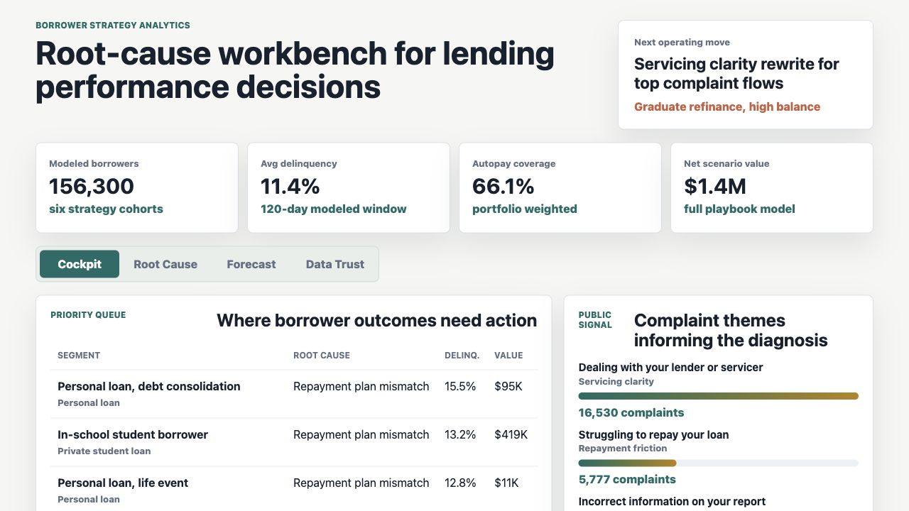
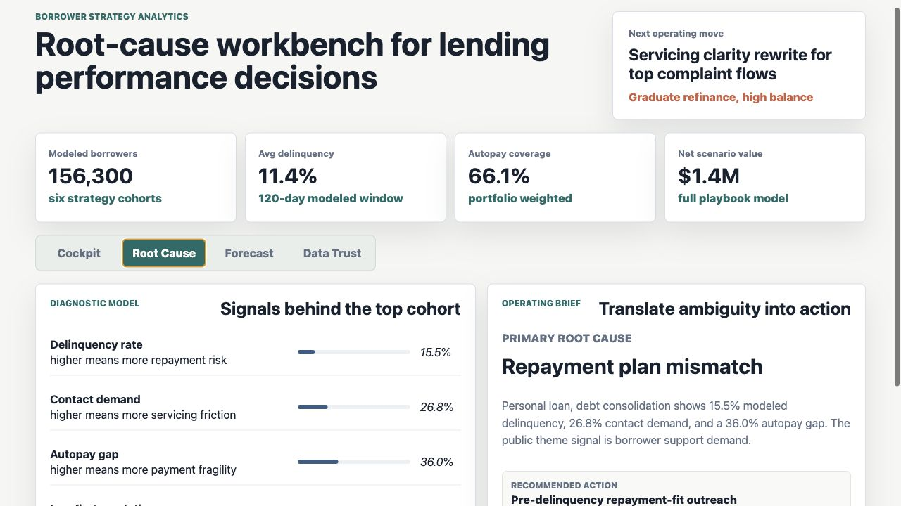
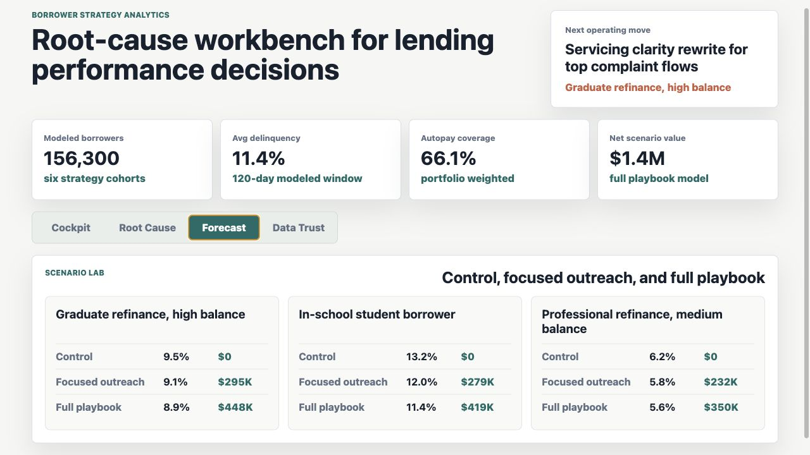

# Borrower Strategy Root Cause Analytics Lab

This project is a borrower strategy analytics workbench for a digital lending business. It turns repayment, application, servicing, complaint, and data-quality signals into a ranked root-cause queue, a scenario forecast, and an operating action plan.

The artifact is built for a business analyst role where the job is to influence strategy, diagnose performance trends, evolve core metrics, and help product, operations, and leadership decide what to do next.



**Executive borrower health cockpit:** portfolio metrics, ranked borrower-cohort risks, public complaint themes, and the first three recommended actions for an operating review.



**Root-cause diagnostic surface:** explains why the top cohort is being flagged by combining delinquency, contact demand, autopay gap, first-contact resolution, public issue themes, and model confidence.



**Scenario forecast surface:** compares control, focused outreach, and full-playbook scenarios so leaders can weigh borrower outcome improvement against operating effort.

## What The Workbench Does

- Profiles public student-loan complaint themes to anchor the borrower-friction taxonomy.
- Generates protected internal-style borrower cohorts and daily operating metrics.
- Scores each cohort with an explainable root-cause model.
- Converts the model output into owner-ready recommendations.
- Forecasts operating scenarios for control, focused outreach, and full playbook actions.
- Adds data-confidence checks and SQL examples so recommendations can be challenged in review.

## Data

The artifact uses a mixed data strategy.

- Public data: a CFPB student-loan complaint download is used locally to summarize issue themes into `data/public_complaint_themes.csv`.
- Synthetic data: borrower segments, daily borrower metrics, intervention assumptions, and quality checks are generated by `scripts/score_operating_data.py`.
- Generated outputs: `analysis/outputs/root_cause_queue.csv`, `analysis/outputs/scenario_forecast.csv`, `analysis/outputs/cohort_action_plan.csv`, and `analysis/outputs/summary.json`.

The synthetic data is modeled on common lending operations structures: product type, channel, borrower count, average balance, delinquency rate, contact rate, application completion, first-contact resolution, autopay behavior, intervention effort, and data confidence. It does not represent any lender's actual performance.

## How It Connects To The Role

This artifact demonstrates the core business analyst work behind a lending strategy role: moving past reporting, diagnosing root causes, building metrics that support decisions, using SQL-ready outputs, quantifying forecast tradeoffs, and turning ambiguous borrower performance patterns into clear recommendations for cross-functional stakeholders.

## Scope

This is a portfolio artifact, not a production lending model. It does not make credit decisions, use customer-level protected data, or claim actual portfolio performance. It shows how to structure the analysis, generate a defendable decision queue, document assumptions, and prepare an interview-ready strategy discussion.

## Run Locally

```bash
npm run analyze
npm run start
```

Then open `http://localhost:4180`.
